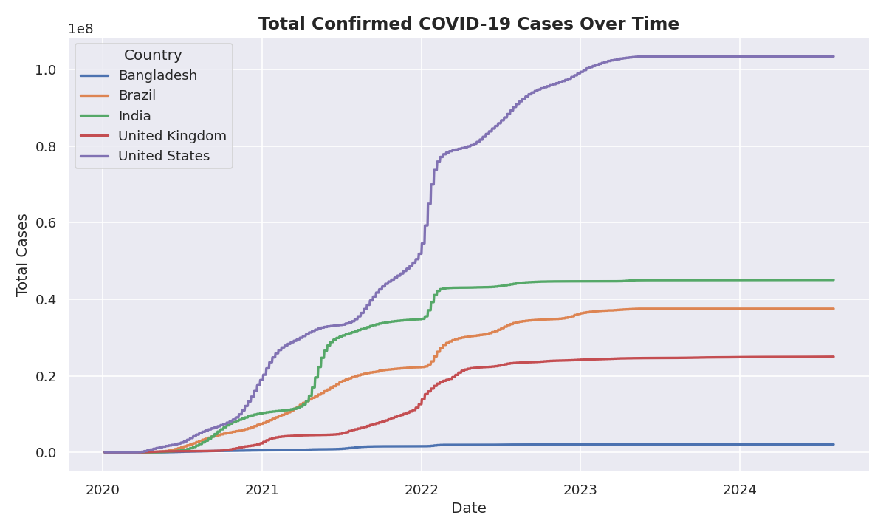
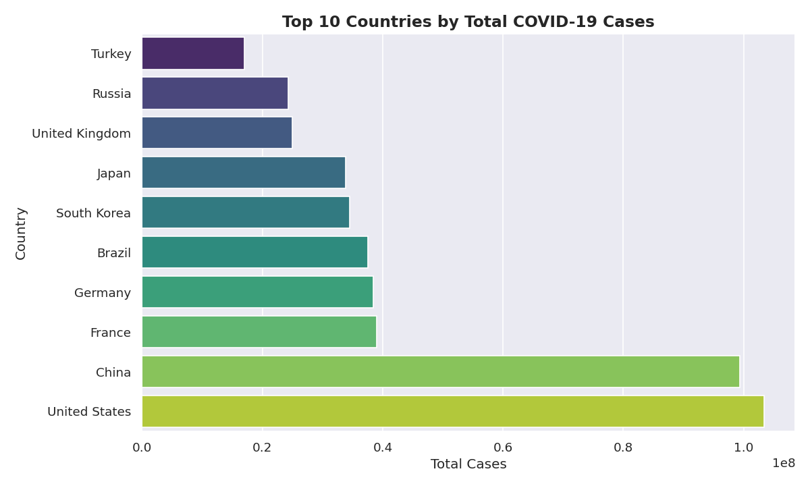
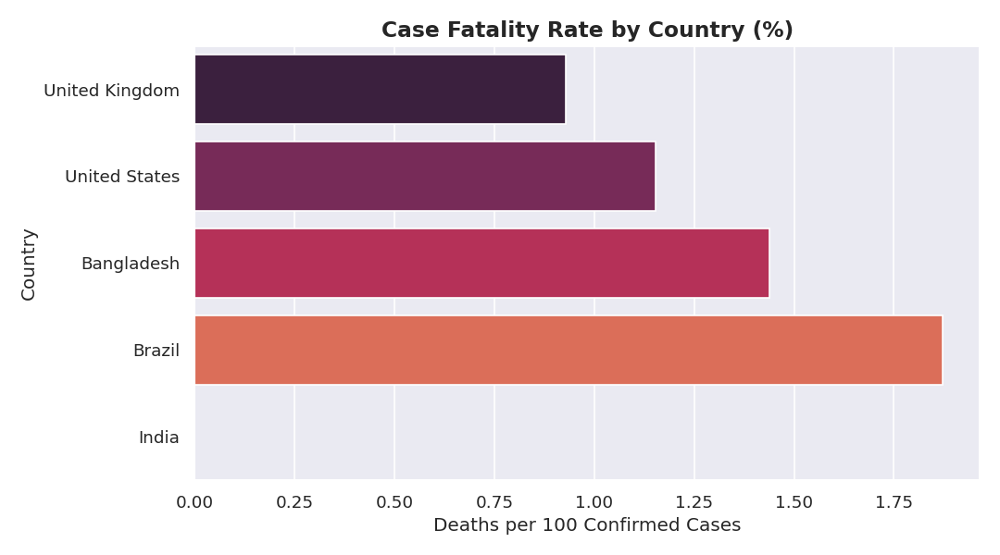
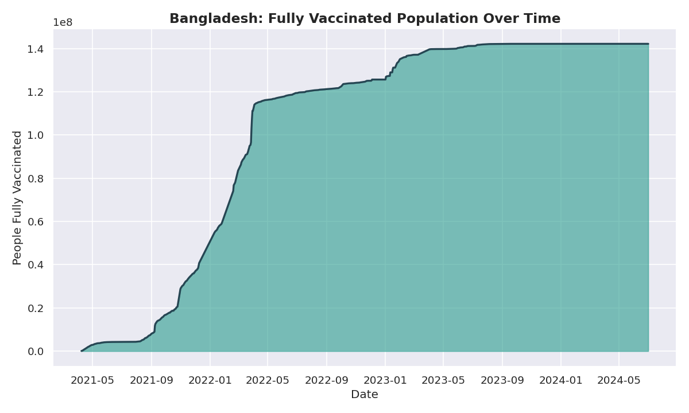

# COVID-19 Global Data Analysis

A data analysis project exploring the spread, mortality, and vaccination
progress of COVID-19 across the world, with a focus on Bangladesh
compared to major countries such as India, the United States, the
United Kingdom, and Brazil.

## Dataset

The data comes from [Our World in Data](https://github.com/owid/covid-19-data),
a continuously updated, open-access COVID-19 dataset covering confirmed
cases, deaths, hospitalizations, testing, and vaccinations for every
country in the world (2020–2024).

## What This Project Does

- Cleans and prepares the raw dataset for analysis
- Compares case trends across five countries over time
- Ranks the top 10 countries by total confirmed cases
- Calculates and visualizes the case fatality rate by country
- Tracks Bangladesh's vaccination rollout over time

## Visualizations

### 1. Case Trend Over Time


### 2. Top 10 Countries by Total Cases


### 3. Case Fatality Rate by Country


### 4. Bangladesh Vaccination Progress


## Project Structure

```
covid-analysis/
├── data/
│   └── covid_19.csv       # Raw dataset (OWID)
├── visuals/                # Generated charts (created on run)
├── analysis.py              # Main analysis + visualization script
├── requirements.txt
├── .gitignore
└── README.md
```

## How to Run

1. Clone this repository
   ```bash
   git clone https://github.com/Rifad111/Git_demo.git
   cd Git_demo
   ```

2. Create a virtual environment and install dependencies
   ```bash
   uv venv
   uv pip install -r requirements.txt
   ```

3. Run the analysis
   ```bash
   uv run analysis.py
   ```

   Charts will be generated inside the `visuals/` folder.

## Tools Used

- **Python** — core language
- **Pandas** — data cleaning and aggregation
- **Matplotlib / Seaborn** — data visualization

## Key Insight

Despite having one of the highest populations among developing nations,
Bangladesh maintained a comparatively low case fatality rate, and steadily
scaled its vaccination coverage from 2021 onward — reflecting a broader
public health rollout across South Asia.

## Author

Mahmudul — Aspiring AI/ML Engineer
